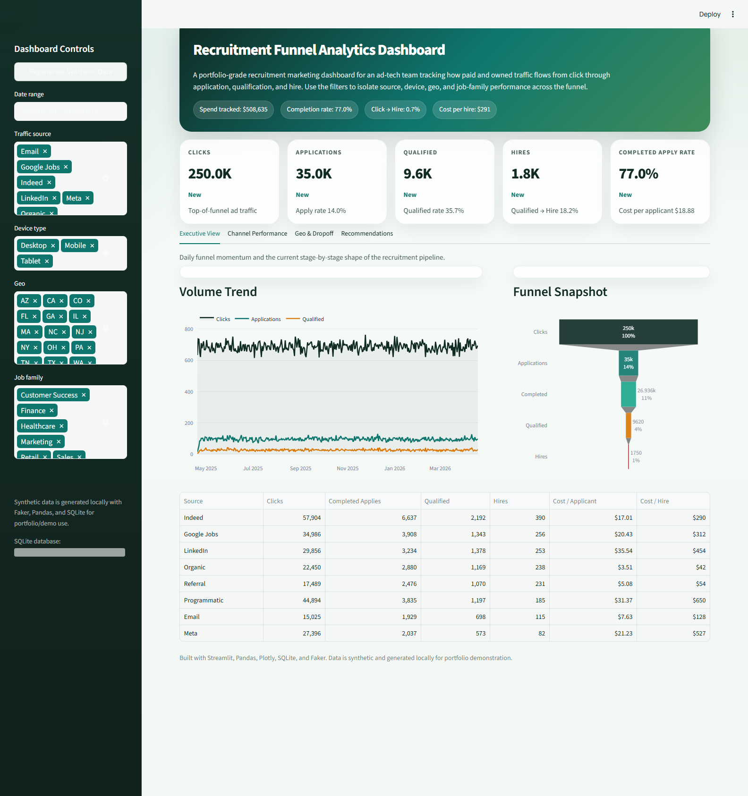
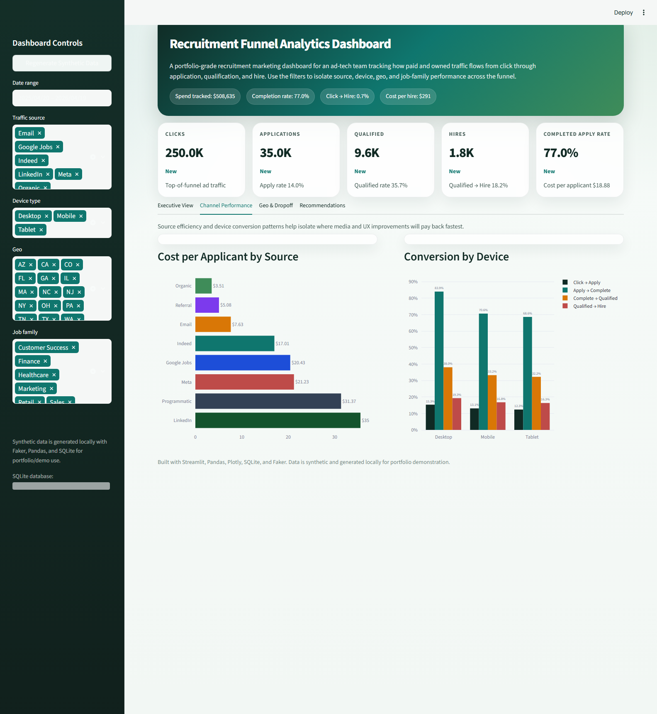
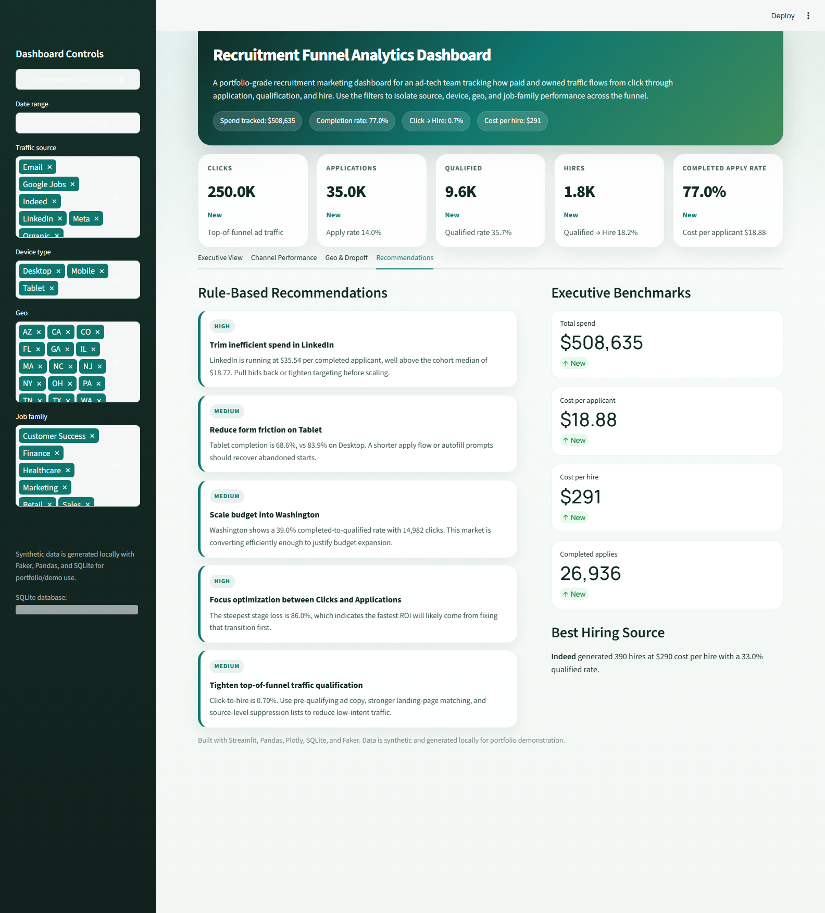

# Recruitment Funnel Analytics Dashboard

A polished Streamlit portfolio project for recruitment marketing analytics. The app simulates how an ad-tech company can monitor funnel efficiency from ad click to completed application, qualified candidate, and hire.

## What It Includes

- 250,000 synthetic ad clicks stored in SQLite
- 35,000 synthetic job applications with completion, qualification, and hire flags
- 8 traffic sources: Indeed, LinkedIn, Google Jobs, Meta, Organic, Referral, Email, and Programmatic
- Filters for date range, source, device, geo, and job family
- Interactive Plotly charts for funnel health, cost efficiency, device conversion, geo concentration, and stage dropoff
- Rule-based recommendations panel for quick optimization ideas
- GitHub-ready project structure and docs

## Tech Stack

- Python
- Streamlit
- Pandas
- Plotly
- SQLite
- Faker

## Project Structure

```text
recruitment-funnel-dashboard/
├── .streamlit/
│   └── config.toml
├── app.py
├── data/                     # generated on first run
├── requirements.txt
├── README.md
├── screenshots/
└── src/
    ├── analytics.py
    ├── data_generator.py
    └── __init__.py
```

## Run Locally

1. Create a virtual environment.
2. Install dependencies:

```bash
pip install -r requirements.txt
```

3. Launch the dashboard:

```bash
streamlit run app.py
```

On first run, the app generates the SQLite dataset automatically at `data/recruitment_funnel_analytics.db`.

## Dashboard Features

### 1. Funnel Metrics

Track the recruitment funnel from:

- Click
- Apply
- Qualified
- Hire

### 2. Cost Per Applicant by Source

Compare spend efficiency across each traffic source and isolate where applicant acquisition is becoming expensive.

### 3. Conversion by Device

See where desktop, mobile, and tablet traffic break down across the funnel to surface UX friction or intent gaps.

### 4. Geo Heatmap

Map qualified candidate concentration by U.S. state and review supporting efficiency metrics in hover details.

### 5. Dropoff Analysis

Measure stage leakage through the funnel and inspect source-level conversion health with a stage-rate heatmap.

### 6. Recommendations Panel

Rule-based recommendations flag:

- expensive channels
- weak device completion performance
- high-opportunity geos
- the biggest funnel bottleneck

## Synthetic Data Model

The dataset is intentionally designed to look realistic for recruitment performance analysis:

- source-level CPC and quality differences
- device-specific completion patterns
- geo-level qualification bias
- job-family and seniority mix
- staggered application timing after clicks

All records are synthetic and safe for demos, portfolio sharing, and interview projects.

## Screenshots

Screenshots are stored in the `screenshots/` folder.

- `screenshots/dashboard-overview.png`
- `screenshots/channel-performance.png`
- `screenshots/recommendations.png`

### Dashboard Overview



### Channel Performance



### Recommendations Panel



## Portfolio Notes

This project is a strong fit for showcasing:

- marketing analytics dashboard design
- funnel analytics thinking
- synthetic data engineering
- KPI storytelling for talent acquisition teams
- Python product sense for business-facing tools
